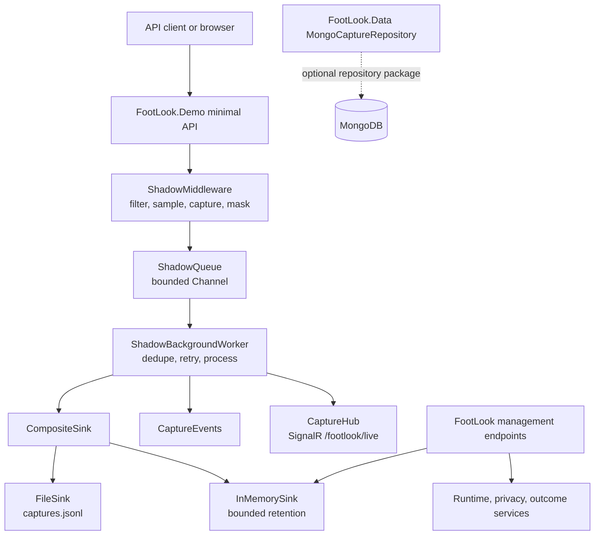
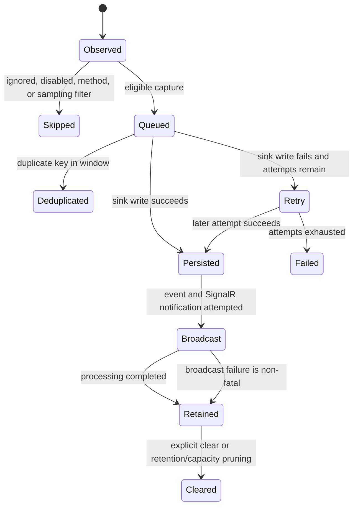
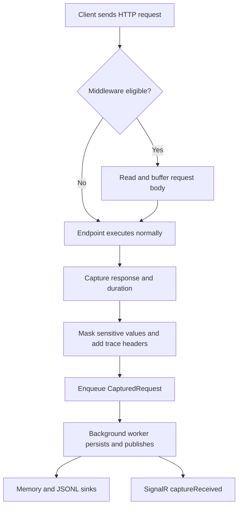
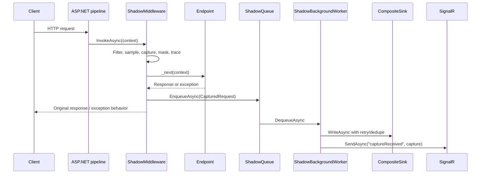
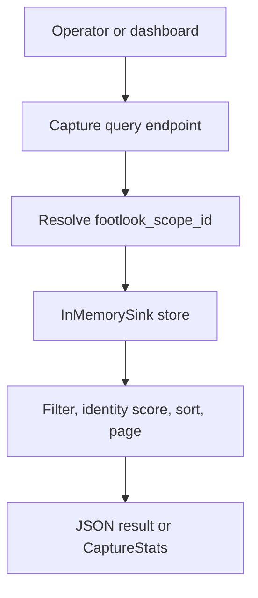
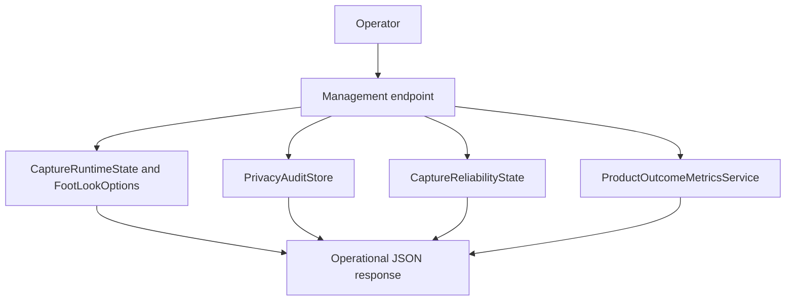
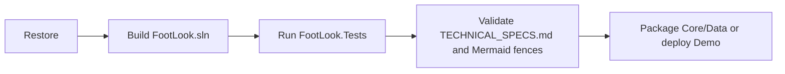

# FootLook Solutions Architecture

> **Document Version**: 1.0.0 - Last Updated: 2026-08-26 - Generated by: solutions-architect agent
>
> **Scope**: Current source tree baseline. This document describes behavior verified in `FootLook.Core`, `FootLook.Data`, `FootLook.Demo`, and the available test project.

## 1. System Overview

### What This System Does
FootLook is an ASP.NET Core observability library and demo host that records HTTP request and response activity without requiring endpoint changes. It measures status, duration, body metadata, correlation and trace context, then makes captures available for local inspection, JSONL persistence, operational metrics, and live SignalR updates.

The system is designed for developers and operators investigating API behavior. It runs asynchronously so the request pipeline can return the original response while a background worker processes the capture.

### Who Uses This System
- API developers integrate FootLook into an ASP.NET Core host and inspect captured traffic.
- QA engineers exercise demo endpoints and verify capture, privacy, reliability, and live-update behavior.
- Operators use health, reliability, privacy, diagnostics, and outcome endpoints to understand the observability subsystem.

### Key Capabilities
- Captures eligible HTTP requests and responses through middleware.
- Preserves request and response bodies when content types and options allow it, with configurable truncation.
- Masks sensitive headers, query parameters, and body fields; optionally hashes client IP and user agent.
- Adds or propagates correlation and W3C trace headers on captured responses.
- Buffers captures in a bounded asynchronous queue and holds them in memory, scoped to the observation session that recorded them and deleted when it ends. Writing to `captures.jsonl` is opt-in (`EnableFileSink`, off by default) because the file cannot be purged per session.
- De-duplicates recent captures, retries sink writes, records reliability telemetry, and broadcasts persisted captures over SignalR.
- Provides capture search, paging, statistics, history, identity correlation, runtime control, privacy audit, diagnostics, setup profiles, and product outcome metrics.

### What This System Does NOT Do
- It does not provide authentication or authorization for the FootLook management endpoints in the current demo.
- It does not provide a durable active database sink by default; the active sink is memory plus JSONL file storage.
- It does not implement create/update/delete CRUD for captured records. Captures are append-only observations, with clear as the only destructive operation.
- It does not provide a message broker, distributed queue, alert delivery system, or multi-instance coordination.
- The Mongo repository is registered by the demo but is not used by the active `IShadowSink` composition or capture endpoints.

## 2. High-Level Architecture

### System at a Glance
The demo is a .NET 8 minimal API host. `AddFootLook` registers the singleton runtime state, bounded queue, in-memory store, file sink, metrics services, and hosted worker. `UseFootLook` inserts the capture middleware. The middleware observes eligible traffic, applies privacy rules, and enqueues a `CapturedRequest`; `ShadowBackgroundWorker` consumes it, writes to the composite sink, publishes an in-process event, and broadcasts to SignalR clients.

### Architecture Diagram

### Runtime Boundaries
| Boundary | Contract | Failure behavior |
|---|---|---|
| Host to middleware | ASP.NET Core request pipeline | Ineligible requests pass through unchanged. Endpoint exceptions are captured, converted to status 500, then rethrown. |
| Middleware to queue | `IShadowQueue.EnqueueAsync` | Queue is bounded and configured with `DropOldest`; capture loss is possible under sustained pressure. |
| Worker to sinks | `IShadowSink.WriteAsync` | Composite sink continues across sink failures; worker retries the composite write and records failures. |
| Worker to live clients | SignalR `captureReceived` | Broadcast errors are non-fatal by default. |
| API to store | `IShadowCaptureStore` | Current API reads the in-memory store, scoped by `footlook_scope_id` for list/statistics endpoints. |

## 3. Module & Component Reference

### `FootLook.Core.Middleware.ShadowMiddleware`
**Type**: Middleware  
**Location**: `FootLook.Core/Middleware/ShadowMiddleware.cs`  
**Responsibility**: Captures eligible request/response exchanges and applies correlation, privacy, sampling, and body policies.  
**Depends On**: `IShadowQueue`, `FootLookOptions`, `CaptureRuntimeState`, `PrivacyAuditStore`, ASP.NET Core `HttpContext`, `Activity`.  
**Consumed By**: `UseFootLook` application extension.  
**Exposes**: `InvokeAsync`.  
**What Breaks If This Is Removed**: No automatic request observation, privacy masking, capture scope cookie, or queue input occurs.  
**Developer Notes**: It replaces the response stream temporarily, restores it in `finally`, and rethrows endpoint exceptions after enqueueing the capture.

### `ShadowQueue` and `IShadowQueue`
**Type**: Queue / interface  
**Location**: `FootLook.Core/Queue/ShadowQueue.cs`, `FootLook.Core/Interfaces/IShadowQueue.cs`  
**Responsibility**: Decouples request latency from capture persistence using a bounded single-reader, multi-writer channel.  
**Depends On**: `System.Threading.Channels`, `FootLookOptions`.  
**Consumed By**: Middleware and background worker.  
**Exposes**: `EnqueueAsync`, `DequeueAsync`.  
**What Breaks If This Is Removed**: Captures cannot move from the HTTP pipeline to asynchronous processing.  
**Developer Notes**: Capacity uses `QueCapacity`; full mode is `DropOldest`.

### `ShadowBackgroundWorker`
**Type**: Hosted service  
**Location**: `FootLook.Core/Services/ShadowBackgroundWorker.cs`  
**Responsibility**: Processes queued captures, performs deduplication and retry, writes sinks, emits events, and broadcasts live updates.  
**Depends On**: Queue, composite sink, `CaptureEvents`, SignalR hub context, reliability and outcome services, options.  
**Consumed By**: ASP.NET Core hosting lifecycle.  
**Exposes**: Hosted `ExecuteAsync` behavior.  
**What Breaks If This Is Removed**: Captures remain queued and never reach storage, metrics, events, or live clients.  
**Developer Notes**: Deduplication keys prefer `Idempotency-Key`, then correlation, then trace identifiers. Sink retry uses exponential backoff.

### Sink Layer
**Type**: Persistence services  
**Location**: `FootLook.Core/Sinks`, `FootLook.Core/Interfaces/InMemorySink.cs`  
**Responsibility**: Stores captures in memory and appends serialized captures to JSONL; `CompositeSink` coordinates both.  
**Depends On**: `FootLookOptions`, filesystem, concurrent collections, `System.Text.Json`.  
**Consumed By**: Background worker and capture APIs.  
**Exposes**: `IShadowSink.WriteAsync`, `IShadowCaptureStore.GetAll`, `GetById`, `Clear`.  
**What Breaks If This Is Removed**: Captures cannot be queried or persisted.  
**Developer Notes**: Memory is capped by `MaxInMemoryCaptures` and retention age. File rotation uses `MaxFileSizeBytes`; old archives are removed using `RetentionDays`.

### `FootLookEndpointExtensions`
**Type**: Endpoint mapping / API layer  
**Location**: `FootLook.Core/Extensions/FootLookEndpointExtensions.cs`  
**Responsibility**: Maps the management API under `EndpointBasePath`, default `/footlook`.  
**Depends On**: Store, options, runtime, reliability, privacy, identity, developer experience, and outcome services.  
**Consumed By**: Demo startup.  
**Exposes**: Health, capture, privacy, reliability, operations, diagnostics, setup, outcome, pause, and resume routes.  
**What Breaks If This Is Removed**: The dashboard and operational control API disappear, although middleware capture can still be registered.  
**Developer Notes**: No endpoint metadata or authorization policy is applied here.

### `CaptureIdentityResolver` and outcome services
**Type**: Utility and in-process state services  
**Location**: `FootLook.Core/Services`  
**Responsibility**: Correlates captures to session/tab identifiers and tracks setup, sessions, investigations, reliability, and privacy outcomes.  
**Depends On**: Captured model, concurrent collections, options.  
**Consumed By**: Management endpoints and background worker.  
**Exposes**: Resolution, snapshots, state transitions, diagnostics, self-healing, and setup profiles.  
**What Breaks If This Is Removed**: Operational visibility and product outcome reporting disappear; core capture storage can still function.

### `FootLook.Data.MongoCaptureRepository`
**Type**: Repository  
**Location**: `FootLook.Data/Repositories/MongoCaptureRepository.cs`  
**Responsibility**: Provides MongoDB read/search/statistics access through `ICaptureRepository`.  
**Depends On**: MongoDB.Driver, `FootLookOptions`.  
**Consumed By**: DI registration only in the current demo; no active endpoint consumes it.  
**Exposes**: Recent, stats, search, and paged-read methods.  
**What Breaks If This Is Removed**: Mongo repository consumers cannot compile or resolve, but the default in-memory/file capture path is unaffected.  
**Developer Notes**: `SearchAsync` currently accepts filters but returns the first 100 records without applying them. `MongoSink` is commented out and is not an active sink.

## 4. Data Model & Entity Reference

### `CapturedRequest`
**What It Represents**: One observed HTTP request/response exchange after capture and privacy processing.  
**Table / Collection**: In-memory queue/store and JSONL file `captures.jsonl`; Mongo collection is configured as `captures` only for repository consumers.  
**Lifecycle**: Created by middleware, optionally dropped by queue pressure or deduplication, persisted by sinks, retained in memory until capacity/retention cleanup, and cleared through the capture delete route.

#### Fields
| Field | Type | Required | Description | Business rule |
|---|---|---:|---|---|
| `Id` | `Guid` | Yes | Capture identifier | Generated by default. |
| `TimestampUtc` | `DateTime` | Yes | Capture creation time | UTC default. |
| `Method`, `Path` | `string` | Yes | Masked HTTP method and path/query | Sensitive query values are redacted when enabled. |
| `Headers` | `Dictionary<string,string>` | Yes | Request headers | Sensitive header values are replaced. |
| `RequestBody`, `ResponseBody` | `string?` | No | Optional bodies | Only allowed content types; truncated at `MaxBodyLength`. |
| `StatusCode` | `int` | Yes | Response status | Exception path is recorded as 500 before rethrow. |
| `DurationMs` | `long` | Yes | End-to-end middleware duration | Used for slow and SLO metrics. |
| `Exception` | `string?` | No | Endpoint exception message | No stack trace is stored in the model. |
| Trace fields | `string` | Yes | Correlation and W3C trace context | Empty when unavailable; response headers are populated where possible. |
| `ServiceName`, `EnvironmentName` | `string` | Yes | Deployment identity | Taken from options. |
| Size/content capture fields | `long`, `string?`, `bool` | Yes/No | Sizes, content types, capture flags, skip reasons | Explain why bodies were or were not captured. |
| `UserAgent`, `ClientIp` | `string?` | No | Client metadata | Hashed to a short SHA-256 value when configured. |
| `CaptureScopeId` | `string?` | No | Browser isolation identifier | The current implementation creates the cookie but does not assign it to the captured model. |

#### Relationships
| Related entity | Relationship | Description |
|---|---|---|
| `CaptureStats` | Derived aggregate | Calculated from a set of captures. |
| `PrivacyAuditEntry` | One-to-many conceptual | A capture can cause audit counters when values are masked. |
| `SessionOutcomeSummary` | Many-to-one conceptual | Captures can be associated with a session through headers and identity scoring. |

#### State Machine

### Derived and operational entities
`CaptureStats`, `TopEndpointStats`, `ReliabilitySnapshot`, `PrivacyAuditEntry`, `ProductOutcomeSnapshot`, `SessionOutcomeSummary`, and developer diagnostic records are in-process DTOs/snapshots. They have no independent database lifecycle or CRUD API.

## 5. Feature Flows & User Journeys

### Feature: Capture and inspect an API request
#### Plain English (Business)
An API call enters the host. FootLook ignores configured noise, checks capture settings and sampling, reads eligible bodies without preventing the endpoint from reading them, masks sensitive values, and lets the endpoint response continue to the client. The processed observation is queued and later appears in the capture APIs and live dashboard.

#### Test Scenarios
| Scenario | Action | Expected result |
|---|---|---|
| Eligible request | Call `/test2` with JSON | Response is unchanged; capture contains status, duration, request and response metadata. |
| Ignored path | Call `/footlook/health` or `/` | Request passes through and is not captured. |
| Unsupported body type | Send an unsupported content type | Capture records a skip reason and does not store that body. |
| Endpoint failure | Call `/error` | Client receives the exception behavior of the host; capture records status 500 and exception message; worker continues. |
| Slow request | Call `/slow` | Duration is approximately two seconds and contributes to slow statistics. |
| Sampled out request | Set sampling to zero or below | Endpoint runs without a capture. |

#### Swimlane

#### Technical Sequence

### Feature: Query and analyze captures
#### Plain English (Business)
An operator can list recent captures, filter and sort them, retrieve statistics, inspect history, find a capture by identifier, or correlate captures to a browser session and tab. List and statistics routes use a browser scope cookie so separate browser scopes do not share those views.

#### Test Scenarios
| Scenario | Action | Expected result |
|---|---|---|
| Paging bounds | Request page size below 1 or above 100 | Size is clamped to 1..100. |
| Failed-only filter | Set `failedOnly=true` | Only status 400+ or exception captures are returned. |
| Empty count | Request recent/history with non-positive count | HTTP 400. |
| Identity missing inputs | Omit session or tab identifier | HTTP 400 from `/captures/identity`. |
| Scope isolation | Use separate scope cookies | Scoped list/statistics do not cross visibility boundaries. |

#### Flow

### Feature: Operate, protect, and measure FootLook
#### Plain English (Business)
Operators can pause and resume capture, inspect privacy and reliability state, run diagnostics, apply self-healing checks or setup profiles, and measure investigation outcomes. These operations update singleton in-process state and reset when the host restarts.

#### Flow

## 6. CRUD Operations Reference

### Entity: `CapturedRequest`
#### Create
| Attribute | Detail |
|---|---|
| **Endpoint / Trigger** | Internal middleware capture followed by `IShadowQueue.EnqueueAsync`. |
| **Who Can Trigger** | Any request that passes enabled, path, method, content, and sampling rules. |
| **Required Input** | HTTP context method, path, response status, and duration. |
| **Optional Input** | Bodies, headers, trace context, client metadata. |
| **Validation / Business Rules** | Bodies require allowed content types and are masked/truncated; request capture receives a scope cookie; sensitive values are redacted. |
| **Side Effects** | Privacy audit entry, queue pressure behavior, later sink write and live event. |
| **Success Output** | No direct capture response; original application response is returned. |
| **Failure Output** | Endpoint errors are captured as 500 and rethrown; sink failures are retried asynchronously. |
| **Database Write** | No database write in the active path. JSONL append and in-memory enqueue occur asynchronously. |

#### Read
| Attribute | Detail |
|---|---|
| **Endpoint / Trigger** | `GET /footlook/captures`, `/captures/recent`, `/captures/history`, `/captures/stats`, `/captures/identity`, `/captures/{id}`. |
| **Who Can Call** | No authorization policy is configured. |
| **Filters** | Status, duration, correlation, path, failed-only, sort, page, count, session/tab identity, confidence, site host. |
| **Pagination** | Page sizes clamp to 1..100; recent default count is 10; history default is 50. |
| **Response** | Capture objects, paged envelopes, or derived statistics. |
| **Performance Notes** | Active in-memory routes enumerate and aggregate the full retained list; no indexes or cache. |

#### Update
No update operation exists. `CapturedRequest` is an immutable record (`init` properties); processing adds no update endpoint.

#### Delete
| Attribute | Detail |
|---|---|
| **Endpoint / Trigger** | `DELETE /footlook/captures`. |
| **Type** | Clear retained in-memory captures; JSONL files are not deleted. |
| **Who Can Delete** | No authorization policy is configured. |
| **Cascade / Reversible** | No related records; not reversible for memory. |
| **Side Effects** | The store refuses to clear when no active scope cookie exists; with a scope it clears the current in-memory queue implementation. |

### Entity: Privacy audit and outcome state
These are service-owned in-process records. They support create/read/clear or start/end operations only: `GET`/`DELETE /footlook/privacy/audit`; session start/end; issue start/complete; and setup profile application. They are not durable and have no update or database CRUD contract.

## 7. API Endpoint Reference

All routes below are under `/footlook` in the demo. No bearer token, role, or authorization policy is configured.

| Method | Route | Purpose |
|---|---|---|
| GET | `/health` | Basic service, sink, and capture configuration health. |
| GET | `/auth/config` | Anonymous. `{ mode: "central" \| "local", projectId, loginUrl }` (the last two only in central mode); the dashboard uses it to decide where to send a browser that has no session. |
| POST | `/auth/exchange` | Anonymous, central mode only. `{ pass }` from FootLook's central sign-in becomes this host's own session token (same response shape as `/auth/microsoft`). 400 `invalid_request`, 401 `invalid_pass`, 503 `central_unavailable`, 404 `disabled` when central mode is off. A pass works once. In central mode `/auth/register`, `/auth/login` and `/auth/microsoft` answer 404 `disabled_in_central_mode`. |
| GET | `/dashboard/ops` | Operational health, reliability, and recent privacy summary. |
| GET | `/dev/diagnostics` | Run configuration diagnostics. |
| POST | `/dev/self-heal` | Apply configuration normalization and return diagnostics. |
| POST | `/dev/setup?profile=development\|staging\|production` | Apply a setup profile and record the outcome. |
| GET | `/outcomes/metrics` | Product outcome snapshot. |
| POST | `/outcomes/session/start?sessionId=&tabId=&siteUrl=` | Start or replace a tracked session. |
| POST | `/outcomes/session/end?sessionId=` | End a tracked session. |
| POST | `/outcomes/issue/start?key=` | Start issue investigation timing. |
| POST | `/outcomes/issue/complete?key=` | Complete timing; 404 if no active key. |
| GET | `/captures` | Scoped, filtered, sorted, paged captures. |
| GET | `/captures/stats` | Scoped aggregate statistics and top endpoints. |
| GET | `/captures/recent` | Recent captures; optional paging and identity scoring. |
| GET | `/captures/identity` | Required session/tab identity-scored captures. |
| GET | `/captures/{id}` | Find a capture by GUID in `InMemorySink`. |
| DELETE | `/captures` | Clear in-memory captures. |
| GET | `/captures/history` | Most recent in-memory captures. |
| POST | `/captures/pause` | Pause runtime capture and set options disabled. |
| POST | `/captures/resume` | Resume runtime capture and set options enabled. |
| POST | `/pause` | Alias for capture pause. |
| POST | `/resume` | Alias for capture resume. |
| POST | `/footlool/pause` | Legacy/typo pause alias mapped literally. |
| GET | `/captures/status` | Return effective capture state. |
| GET | `/privacy/status` | Return masking, anonymization, retention, and sensitive-field configuration. |
| GET | `/privacy/audit` | Return recent privacy audit events. |
| DELETE | `/privacy/audit` | Clear privacy audit events. |
| GET | `/reliability/status` | Reliability counters, thresholds, and health. |
| GET | `/operations/health` | SLO thresholds, metrics, alerts, and health status. |
| SignalR | `/live` | Receives `captureReceived` broadcasts. |

### Demo-only endpoints
`GET /` returns `FootLook Running`; `POST /pause` and `/resume` control capture; `POST /test2` echoes a `TestRequest`; `GET /slow` delays two seconds; `GET /error` throws a simulated exception. Swagger is enabled only in Development. Static `footlook.html` is served by the host.

## 8. QA Testing Guide

### 8.1 System Test Entry Points
- All routes in Section 7.
- Any application endpoint passing through `UseFootLook`.
- Hosted `ShadowBackgroundWorker` startup, queue consumption, retry, and shutdown.
- SignalR client connection to `/footlook/live` and `captureReceived` event handling.

### 8.2 Integration Boundaries
| Integration | Data sent | Data expected | Failure behavior |
|---|---|---|---|
| ASP.NET pipeline | Request/response streams and headers | Endpoint response | Original response stream is restored; endpoint exceptions are rethrown. |
| File system | Serialized `CapturedRequest` JSONL | Append success | Composite catches sink failure; worker retries composite write. |
| SignalR | Capture payload and event name `captureReceived` | Client broadcast | Counted as broadcast failure; non-fatal by default. |
| MongoDB repository | Repository filters and capture reads | Mongo documents | Only relevant to explicit repository consumers; not active in default sink path. |

### 8.3 State Transition Tests
| From | To | Trigger | Expected behavior |
|---|---|---|---|
| Enabled | Paused | POST pause route | Runtime and options report capture disabled. |
| Paused | Enabled | POST resume route | New eligible requests can be captured. |
| Observed | Skipped | Ignore/method/sampling/disabled rule | Endpoint still executes; no queued capture. |
| Queued | Deduplicated | Matching key within window | Capture is discarded and deduplication counter increments. |
| Queued | Retry | Sink write throws | Retry counter/event increments and exponential delay is applied. |
| Retry | Failed | All attempts fail | Persist failure is recorded; worker continues with later items. |
| Persisted | Retained | Sink succeeds | Event and broadcast are attempted; capture is queryable in memory. |

### 8.4 Negative Test Catalogue
- Missing required session/tab identity fields.
- Non-positive count values and page/page-size boundary values.
- Unsupported content types and bodies larger than `MaxBodyLength`.
- Sensitive headers, query parameters, JSON fields, form fields, IPs, and user agents are not leaked when masking is enabled.
- Queue saturation should demonstrate `DropOldest` behavior and expected loss risk.
- Duplicate idempotency, correlation, and trace keys inside the configured window.
- Sink write failures and retry exhaustion.
- SignalR broadcast failure with both non-fatal and fatal configuration.
- Unauthenticated access to management routes, since authorization is currently absent.
- Mongo search filters, noting the current implementation does not apply them.

### 8.5 Known Behaviors & Workarounds
- Capture state and metrics are singleton in-process state and reset on restart.
- `/captures` list/statistics scope by cookie, while `/captures/recent`, history, identity, and single-item lookup do not consistently apply that scope.
- `CaptureScopeId` is defined on the model but is not assigned by middleware, so model-level scope filtering depends on the current implementation state.
- `CompositeSink` catches individual sink failures, which can make a worker-level write appear successful even when one sink failed.
- The demo registers `ICaptureRepository` but current endpoints use `IShadowCaptureStore`; Mongo configuration alone does not switch active persistence.

## 9. Deployment & Pipeline Reference

### 9.1 Environment Overview
| Environment | Purpose | URL | Branch |
|---|---|---|---|
| Development | Local demo and Swagger testing | Configured by `launchSettings.json` | Not defined in repository |
| Staging | Configuration profile target | Not defined | Not defined |
| Production | Configuration profile target | Not defined | Not defined |

The solution targets .NET 8. The demo is a web executable; Core and Data are packageable class libraries. No container, hosting manifest, CI workflow, or deployment script was found in the scanned repository.

### 9.2 CI/CD Pipeline Steps
No pipeline is currently defined. The minimum expected verification sequence is:

### 9.3 Configuration & Secrets
| Setting | Purpose | Source |
|---|---|---|
| `FootLook:UseMongoSink` | Declared Mongo option; does not currently activate the sink | `appsettings.json`, options binding |
| `FootLook:IgnoredPathPrefixes` | Adds noise/scanner prefixes to ignored paths | `appsettings.json` |
| `CaptureRequestBody`, `CaptureResponseBody` | Body capture controls | Demo `AddFootLook` configuration |
| `MaxBodyLength`, `QueCapacity`, `SamplingRate` | Capture size, queue capacity, and sampling | Demo configuration |
| `PrivacyHashSalt` | Optional salt for client metadata hashing | Options/user secrets/environment configuration |
| `MongoConnectionString`, `MongoDatabaseName`, `MongoCollectionName` | Mongo repository connection and collection | Options/user secrets/environment configuration |
| `MaxInMemoryCaptures`, `MaxFileSizeBytes`, `RetentionDays` | Retention and rotation | Options/configuration |
| `FootLook:Central:ProjectId` | Turns on central sign-in. The project's id from the FootLook website: a public label, **not a secret**; no secret from FootLook is needed. Empty = local accounts as before | `appsettings.json` or `o.Central.ProjectId` |
| `FootLook:Central:Issuer`, `JwksUrl`, `LoginUrl`, `ClockSkewSeconds` | Optional overrides of the central service address (default `https://footlook-auth.azurewebsites.net`), where its public key set is downloaded (default `{Issuer}/.well-known/jwks.json`), the sign-in page (default `https://www.footlook.co.za/connect`) and pass clock tolerance (default 60 s, max 60) | `appsettings.json` |

Never place connection strings or privacy salts in this document or committed settings.

### 9.4 Documentation Publishing
`TECHNICAL_SPECS.md` is the canonical architecture artifact. No documentation publishing pipeline is configured in the repository.

## 10. Changelog

### 2026-08-26 - Initial architecture baseline
**Changed By**: solutions-architect agent  
**Reason**: Manual run requested against the current FootLook solution; no prior architecture document or `.docs-update-needed` marker was present.  
- Added: System overview, topology, module reference, data model, feature flows, CRUD boundaries, API inventory, QA guide, and deployment/configuration reference.
- Added: Explicit documentation of active memory/file persistence versus the unconnected Mongo repository.
- Added: Mermaid topology, entity lifecycle, feature-flow, state-transition, and pipeline diagrams.