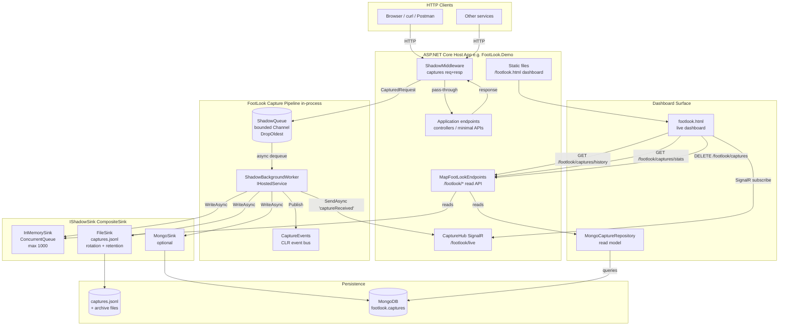
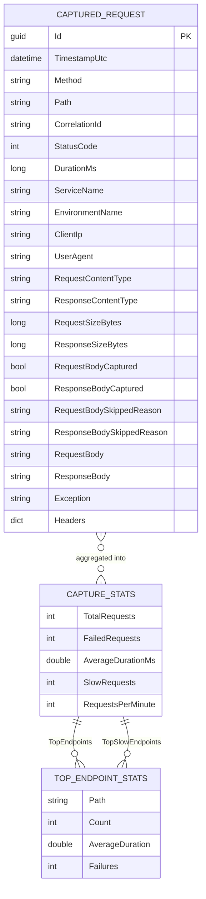
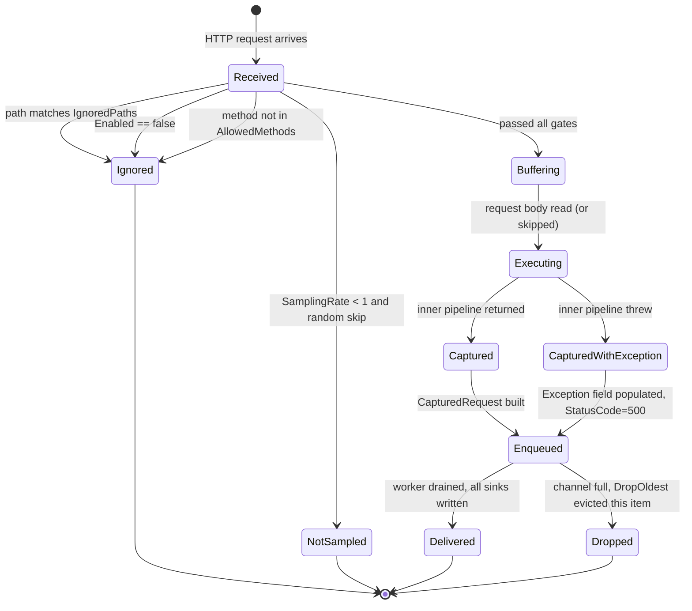
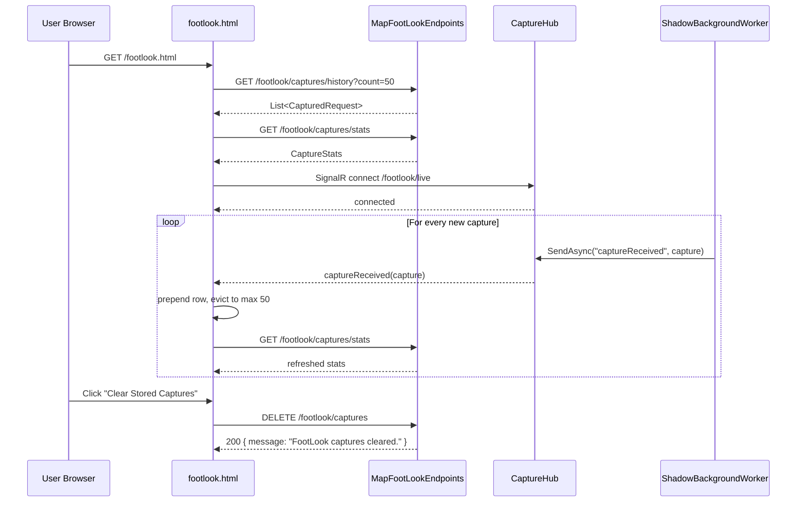

> **Document Version**: 1.0.0 — Last Updated: 2026-06-14 — Generated by: Mfundo-Mthembu

# FootLook — Solutions Architecture

FootLook is a **zero-interaction API observability** library for ASP.NET Core 8. It passively mirrors and captures every HTTP request and response that flows through a host application — without altering the response, without coupling to business logic, and without requiring any code change inside the controllers or minimal-API handlers it observes.

This document is the single source of truth for how FootLook is built, what it captures, and how it surfaces that data through APIs, a live dashboard, and persistent sinks.

---

## 1. System Overview

### What This System Does

FootLook is an **observer**, not a participant. When a developer plugs FootLook into an ASP.NET Core application, every incoming HTTP request and the response sent back is silently copied — headers, body, status code, duration, correlation ID, client IP, exception — and shipped to one or more storage destinations and to a live dashboard. The original request and response are never modified, blocked, or delayed (beyond a few microseconds of buffering).

The system exists so that engineering and operations teams can answer questions like *"what did our API actually receive yesterday?"*, *"why did that customer get a 500?"*, and *"which endpoint is slowest right now?"* — without having to instrument controllers individually, write logging by hand, or stand up a full APM stack.

### Who Uses This System

| User | What they do |
|---|---|
| **API developers** | Drop FootLook into their service, see every request/response without writing logging code |
| **Support / on-call engineers** | Open the live dashboard, watch traffic in real time, filter to failures, click into a capture to see exactly what the client sent and what the server returned |
| **QA engineers** | Replay the JSONL capture file or query MongoDB to verify what the system did during a test run |
| **Architects / data analysts** | Query the MongoDB `captures` collection to mine traffic patterns, top endpoints, error rates |

### Key Capabilities

- Captures every HTTP request and response that flows through the host application's pipeline, with no per-endpoint code changes required.
- Redacts configurable sensitive headers (default: `Authorization`, `Cookie`, `Set-Cookie`, `X-Api-Key`) and masks sensitive JSON body fields (default: `password`, `token`, `accessToken`, `refreshToken`, `credit_card_number`, `ssn`, `cvv`, `secret`, `apiKey`).
- Stamps every capture with a correlation ID (`X-Correlation-ID` header) — reusing the inbound value or generating a new GUID — and echoes it back to the client.
- Writes captures concurrently to multiple destinations (in-memory ring buffer, append-only JSONL file with rotation, optional MongoDB).
- Streams every new capture in real time to any connected dashboard via SignalR.
- Exposes a REST API for paginated/filterable querying of recent captures, statistics, and per-endpoint rollups.
- Provides a ready-to-serve HTML dashboard (`/footlook.html`) with stat cards, a live feed, filters, an RPM chart, and capture detail inspection.
- Supports request sampling, allowed-method filtering, ignored-path filtering, and a global on/off switch.

### What This System Does NOT Do

- **Does not modify** the original request or response. Bodies are read via buffering and re-emitted byte-for-byte.
- **Does not authenticate or authorise** dashboard or API consumers. The FootLook endpoints are exposed under `/footlook` without any built-in auth — securing them is the host application's responsibility.
- **Does not enforce schema or validation** on captured bodies. It records what it sees.
- **Does not retry failed sink writes**. A failure in one sink (e.g. Mongo unreachable) is logged to `Console.Error` and the capture continues to the next sink.
- **Does not provide alerting, dashboards-as-code, or long-term analytics**. It is a capture + live-view library; downstream tooling consumes its outputs.
- **Does not propagate distributed traces**. Correlation IDs are per-request only; there is no parent-span linkage to upstream/downstream services.

---

## 2. High-Level Architecture

### System at a Glance

FootLook is a single .NET 8 library (`FootLook.Core`) plus an optional MongoDB-backed read repository (`FootLook.Data`) and a demo host (`FootLook.Demo`). At runtime, an ASP.NET Core middleware (`ShadowMiddleware`) sits early in the request pipeline. For every request that passes the sampling and filtering gates, it builds a `CapturedRequest` record and pushes it onto an in-process bounded `Channel<T>` queue. A `BackgroundService` (`ShadowBackgroundWorker`) drains the queue, fans the record out to a composite of sinks (in-memory, file, optional MongoDB), publishes a CLR event, and broadcasts the capture over SignalR to all connected dashboard clients. Read-side endpoints (registered via `MapFootLookEndpoints`) serve paginated lists, statistics, and lookups out of the in-memory store or the MongoDB repository.

### Architecture Diagram

---

### Entity-Relationship Diagram

### State Diagram — Capture Lifecycle

A `CapturedRequest` itself is immutable, but the **decision flow** a request travels through inside `ShadowMiddleware` is a state machine worth documenting for QA:

---
#### Sequence Diagram

---
### 9.2 — Required Runtime

- .NET 8 SDK / runtime
- MongoDB 4.x+ if `UseMongoSink=true` or `AddFootLookMongoRepository()` is registered
- Writable filesystem at `AppDomain.CurrentDomain.BaseDirectory` for `captures.jsonl`

