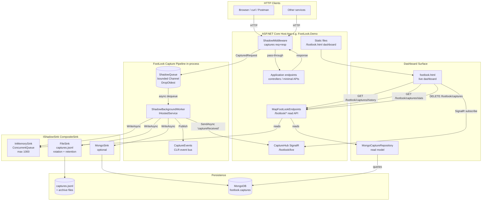
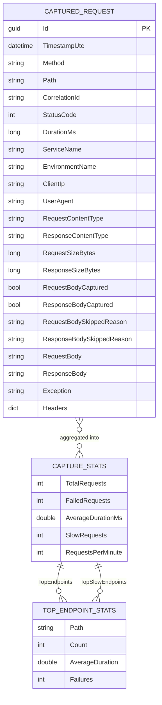
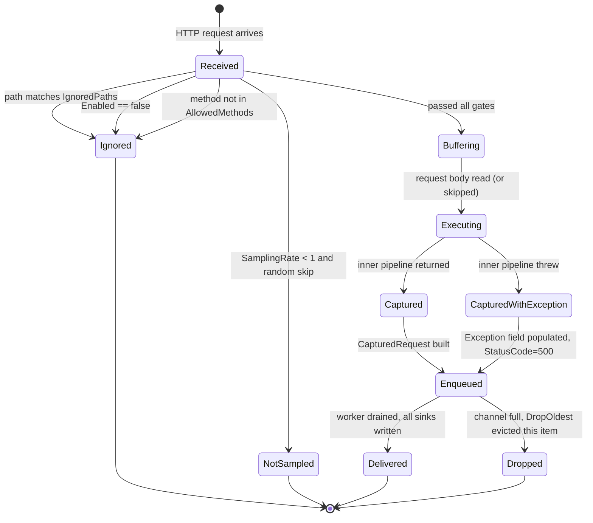
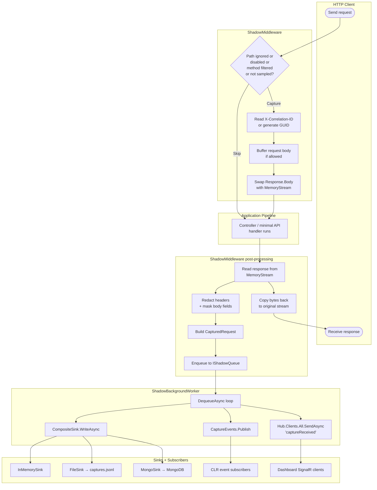
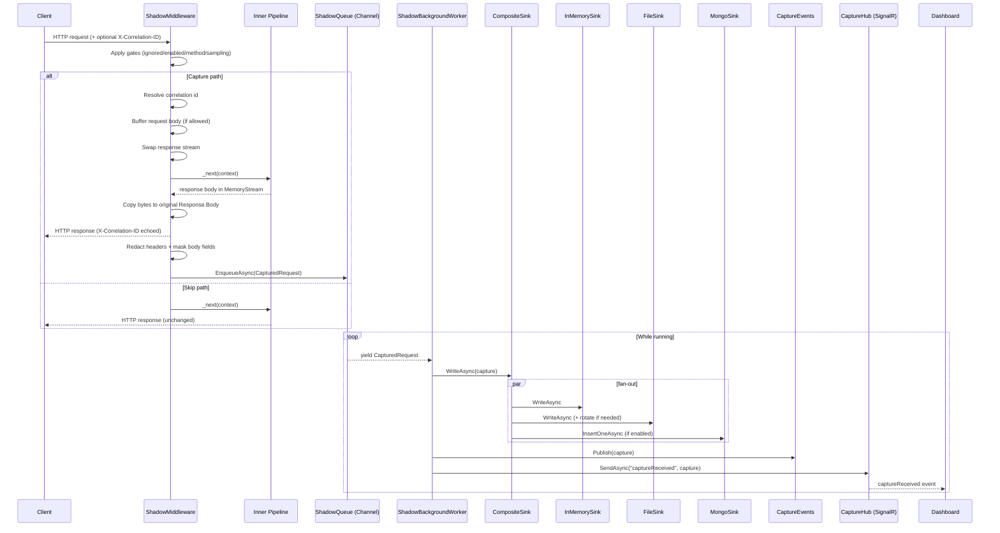
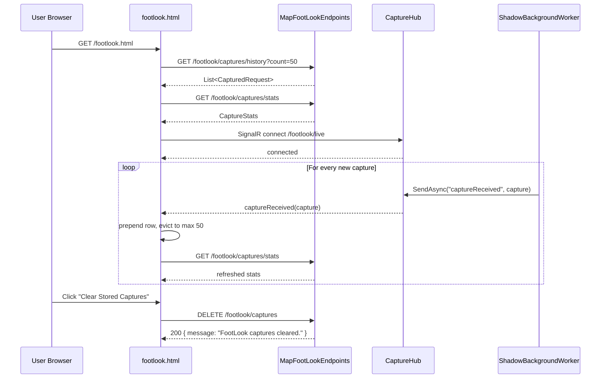
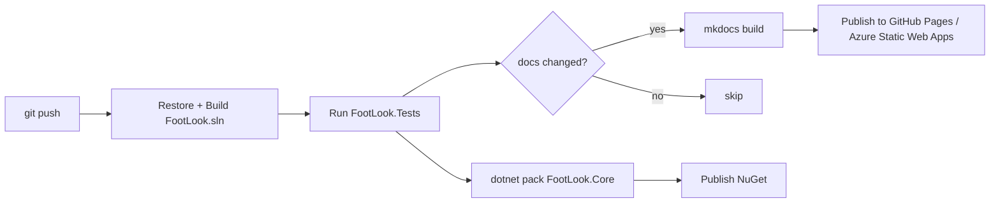

> **Document Version**: 1.0.0 — Last Updated: 2026-06-14 — Generated by: solution-architect skill

# FootLook — Solutions Architecture

FootLook is a **zero-interaction API observability** library for ASP.NET Core 8. It passively mirrors and captures every HTTP request and response that flows through a host application — without altering the response, without coupling to business logic, and without requiring any code change inside the controllers or minimal-API handlers it observes.

This document is the single source of truth for how FootLook is built, what it captures, and how it surfaces that data through APIs, a live dashboard, and persistent sinks.

---

## Table of Contents

1. [System Overview](#1-system-overview)
2. [High-Level Architecture](#2-high-level-architecture)
3. [Module & Component Reference](#3-module--component-reference)
4. [Data Model & Entity Reference](#4-data-model--entity-reference)
5. [Feature Flows & User Journeys](#5-feature-flows--user-journeys)
6. [CRUD Operations Reference](#6-crud-operations-reference)
7. [API Endpoint Reference](#7-api-endpoint-reference)
8. [QA Testing Guide](#8-qa-testing-guide)
9. [Deployment & Pipeline Reference](#9-deployment--pipeline-reference)
10. [Changelog](#10-changelog)

---

## 1. System Overview

### What This System Does

FootLook is an **observer**, not a participant. When a developer plugs FootLook into an ASP.NET Core application, every incoming HTTP request and the response sent back is silently copied — headers, body, status code, duration, correlation ID, client IP, exception — and shipped to one or more storage destinations and to a live dashboard. The original request and response are never modified, blocked, or delayed (beyond a few microseconds of buffering).

The system exists so that engineering and operations teams can answer questions like *"what did our API actually receive yesterday?"*, *"why did that customer get a 500?"*, and *"which endpoint is slowest right now?"* — without having to instrument controllers individually, write logging by hand, or stand up a full APM stack.

### Who Uses This System

| User | What they do |
|---|---|
| **API developers** | Drop FootLook into their service, see every request/response without writing logging code |
| **Support / on-call engineers** | Open the live dashboard, watch traffic in real time, filter to failures, click into a capture to see exactly what the client sent and what the server returned |
| **QA engineers** | Replay the JSONL capture file or query MongoDB to verify what the system did during a test run |
| **Architects / data analysts** | Query the MongoDB `captures` collection to mine traffic patterns, top endpoints, error rates |

### Key Capabilities

- Captures every HTTP request and response that flows through the host application's pipeline, with no per-endpoint code changes required.
- Redacts configurable sensitive headers (default: `Authorization`, `Cookie`, `Set-Cookie`, `X-Api-Key`) and masks sensitive JSON body fields (default: `password`, `token`, `accessToken`, `refreshToken`, `credit_card_number`, `ssn`, `cvv`, `secret`, `apiKey`).
- Stamps every capture with a correlation ID (`X-Correlation-ID` header) — reusing the inbound value or generating a new GUID — and echoes it back to the client.
- Writes captures concurrently to multiple destinations (in-memory ring buffer, append-only JSONL file with rotation, optional MongoDB).
- Streams every new capture in real time to any connected dashboard via SignalR.
- Exposes a REST API for paginated/filterable querying of recent captures, statistics, and per-endpoint rollups.
- Provides a ready-to-serve HTML dashboard (`/footlook.html`) with stat cards, a live feed, filters, an RPM chart, and capture detail inspection.
- Supports request sampling, allowed-method filtering, ignored-path filtering, and a global on/off switch.

### What This System Does NOT Do

- **Does not modify** the original request or response. Bodies are read via buffering and re-emitted byte-for-byte.
- **Does not authenticate or authorise** dashboard or API consumers. The FootLook endpoints are exposed under `/footlook` without any built-in auth — securing them is the host application's responsibility.
- **Does not enforce schema or validation** on captured bodies. It records what it sees.
- **Does not retry failed sink writes**. A failure in one sink (e.g. Mongo unreachable) is logged to `Console.Error` and the capture continues to the next sink.
- **Does not provide alerting, dashboards-as-code, or long-term analytics**. It is a capture + live-view library; downstream tooling consumes its outputs.
- **Does not propagate distributed traces**. Correlation IDs are per-request only; there is no parent-span linkage to upstream/downstream services.

---

## 2. High-Level Architecture

### System at a Glance

FootLook is a single .NET 8 library (`FootLook.Core`) plus an optional MongoDB-backed read repository (`FootLook.Data`) and a demo host (`FootLook.Demo`). At runtime, an ASP.NET Core middleware (`ShadowMiddleware`) sits early in the request pipeline. For every request that passes the sampling and filtering gates, it builds a `CapturedRequest` record and pushes it onto an in-process bounded `Channel<T>` queue. A `BackgroundService` (`ShadowBackgroundWorker`) drains the queue, fans the record out to a composite of sinks (in-memory, file, optional MongoDB), publishes a CLR event, and broadcasts the capture over SignalR to all connected dashboard clients. Read-side endpoints (registered via `MapFootLookEndpoints`) serve paginated lists, statistics, and lookups out of the in-memory store or the MongoDB repository.

### Architecture Diagram



---

## 3. Module & Component Reference

### `ShadowMiddleware`
**Type**: ASP.NET Core middleware  
**Location**: [FootLook/FootLook.Core/Middleware/ShadowMiddleware.cs](FootLook/FootLook.Core/Middleware/ShadowMiddleware.cs)  
**Responsibility**: Intercept every HTTP request, copy the request and response (subject to filtering and sampling), build a `CapturedRequest`, and enqueue it for async processing.  
**Depends On**: `RequestDelegate`, `IShadowQueue`, `FootLookOptions`, `ILogger<ShadowMiddleware>`  
**Consumed By**: Registered into the pipeline via `app.UseFootLook()` (`FootLookApplicationBuilderExtensions`)  
**Exposes**: `InvokeAsync(HttpContext)`  

**What Breaks If This Is Removed**: Nothing is captured. The host application continues to function normally — FootLook is a pure observer. The read API returns empty data, the dashboard shows zero captures, and no sink ever writes.

**Developer Notes**:
- Short-circuit order: ignored-path → `Enabled` flag → allowed-method filter → sampling → capture.
- Uses `Request.EnableBuffering()` to allow downstream handlers to re-read the request body.
- Replaces `Response.Body` with a `MemoryStream`, then copies bytes back to the original stream after the inner pipeline completes — never alters response bytes.
- On exception from the inner pipeline, sets `StatusCode = 500`, enqueues the capture (with `Exception` populated), then **rethrows** — error semantics are preserved.
- Redacts sensitive headers via case-insensitive name match; masks JSON sensitive body fields via the regex `"field"\s*:\s*".*?"` → `"field":"[REDACTED]"`. Note: non-JSON bodies (XML, form-encoded) are **not** masked.

### `ShadowQueue`
**Type**: In-process bounded queue  
**Location**: [FootLook/FootLook.Core/Queue/ShadowQueue.cs](FootLook/FootLook.Core/Queue/ShadowQueue.cs)  
**Responsibility**: Decouple capture (synchronous, on the request thread) from delivery to sinks (asynchronous, background).  
**Depends On**: `FootLookOptions` (reads `QueCapacity`)  
**Consumed By**: `ShadowMiddleware` (writer), `ShadowBackgroundWorker` (reader)  
**Exposes**: `EnqueueAsync(CapturedRequest)`, `DequeueAsync(CancellationToken)` (async enumerable)  

**What Breaks If This Is Removed**: No decoupling — middleware would have to call sinks synchronously, blocking the request thread on file I/O and Mongo writes.

**Developer Notes**:
- Backed by `System.Threading.Channels.Channel<CapturedRequest>` with `BoundedChannelFullMode.DropOldest`. Under load, the **oldest** queued capture is silently dropped to make room — no exceptions are thrown to the producer.
- Configured `SingleReader = true`, `SingleWriter = false`. Multiple middleware threads write concurrently; exactly one background worker reads.

### `ShadowBackgroundWorker`
**Type**: `BackgroundService` (`IHostedService`)  
**Location**: [FootLook/FootLook.Core/Services/ShadowBackgroundWorker.cs](FootLook/FootLook.Core/Services/ShadowBackgroundWorker.cs)  
**Responsibility**: Drain the `IShadowQueue` and dispatch each capture to all sinks, the CLR event bus, and the SignalR hub.  
**Depends On**: `IShadowQueue`, `IShadowSink`, `ILogger<ShadowBackgroundWorker>`, `CaptureEvents`, `IHubContext<CaptureHub>`  
**Consumed By**: ASP.NET Core hosting (auto-started)  
**Exposes**: `ExecuteAsync(CancellationToken)`  

**What Breaks If This Is Removed**: Captures pile up in the channel until eviction begins. Nothing is ever written to a sink, nothing reaches the dashboard, nothing is queryable beyond the in-memory queue (which the worker also never reads).

**Developer Notes**:
- Loops over `_queue.DequeueAsync(stoppingToken)` — the async enumerable yields items as they arrive.
- Sink write errors are caught **inside** `CompositeSink`, not here. Errors raised by event publication or SignalR send are caught in this loop and logged; the worker continues.
- Graceful shutdown: catches `OperationCanceledException` and exits cleanly.

### `IShadowSink` and Implementations

#### `CompositeSink`
**Type**: Fan-out sink  
**Location**: [FootLook/FootLook.Core/Sinks/CompositeSink.cs](FootLook/FootLook.Core/Sinks/CompositeSink.cs)  
**Responsibility**: Iterate a list of `IShadowSink` instances and call `WriteAsync` on each. Per-sink exceptions are caught and written to `Console.Error`; the loop continues to the next sink.

#### `InMemorySink`
**Type**: Ring-buffered in-memory store + `IShadowCaptureStore` implementation  
**Location**: [FootLook/FootLook.Core/Interfaces/InMemorySink.cs](FootLook/FootLook.Core/Interfaces/InMemorySink.cs)  
**Responsibility**: Hold the most recent N captures (default `MaxInMemoryCaptures = 1000`) in a `ConcurrentQueue` for fast read by the `/footlook/captures*` endpoints and the dashboard.  
**Notes**: Eviction is FIFO — when count exceeds the limit, the oldest entry is dequeued. Also exposes `Clear()` and `GetById(Guid)`.

#### `FileSink`
**Type**: Append-only JSONL writer with rotation and retention  
**Location**: [FootLook/FootLook.Core/Sinks/FileSink.cs](FootLook/FootLook.Core/Sinks/FileSink.cs)  
**Responsibility**: Persist every capture as one line of JSON to `captures.jsonl` in the host's base directory. Rotate when the file exceeds `MaxFileSizeBytes` (default 100 MB). Clean up archives older than `RetentionDays` (default 30).  
**Developer Notes**:
- Rotation renames the active file to `captures_{yyyyMMddHHmmss}.jsonl` (underscore separator).
- Cleanup scans for `captures-*.jsonl` (dash separator). **This naming inconsistency means archived files created by rotation are not matched by the cleanup glob — archives accumulate indefinitely.** Tracked as a known issue.
- Serialization uses `System.Text.Json` with default options.

#### `MongoSink`
**Type**: MongoDB writer  
**Location**: [FootLook/FootLook.Core/Sinks/MongoSink.cs](FootLook/FootLook.Core/Sinks/MongoSink.cs)  
**Responsibility**: Insert each capture as a document into the configured MongoDB collection (default `footlook.captures`).  
**Developer Notes**:
- Only registered into the composite when `options.UseMongoSink == true`.
- Maps `CapturedRequest` fields into a private nested document class (also called `MongoCapturedRequest`, distinct from the empty public model). `Id` is stored as `string`, not as a BSON `ObjectId`.
- **No indexes are created** by the sink. For production scale, indexes on `TimestampUtc`, `Path`, `StatusCode`, and `CorrelationId` should be added out-of-band.

### `ICaptureRepository` → `MongoCaptureRepository`
**Type**: Read-model over the MongoDB collection  
**Location**: `FootLook.Data/Repositories/MongoCaptureRepository.cs` (project file ships in the `FootLook.Data` project — see solution file)  
**Responsibility**: Serve aggregate queries (`GetRecentAsync`, `GetStatsAsync`, `SearchAsync`) used by the read endpoints and `/mongo-test` route.  
**Developer Notes**:
- `GetStatsAsync` performs a **full collection scan** then aggregates in memory — fine for dev, will not scale to millions of documents.
- `RequestsPerMinute` is **not populated** by the repository (left at default `0`). The dashboard computes its own RPM client-side from arrival timestamps.
- `SearchAsync` is currently a stub — ignores all parameters and returns the first 100 documents.

### `CaptureHub`
**Type**: SignalR Hub  
**Location**: [FootLook/FootLook.Core/Hubs/CaptureHub.cs](FootLook/FootLook.Core/Hubs/CaptureHub.cs)  
**Responsibility**: Server → client broadcast surface. No client-callable methods. The server pushes the `captureReceived` event to all connected clients from `ShadowBackgroundWorker`.  
**URL**: `/footlook/live` (mapped in the host's `Program.cs`).

### `CaptureEvents`
**Type**: In-process CLR event publisher  
**Location**: [FootLook/FootLook.Core/Services/CaptureEvents.cs](FootLook/FootLook.Core/Services/CaptureEvents.cs)  
**Responsibility**: Allow host applications to subscribe to `OnRequestCaptured` and react in-process (e.g. structured logging, side-channel telemetry). The demo subscribes a console writer.

### `CaptureHistoryService`
**Type**: File reader  
**Location**: [FootLook/FootLook.Core/Services/CaptureHistoryService.cs](FootLook/FootLook.Core/Services/CaptureHistoryService.cs)  
**Responsibility**: Read the most recent N lines from `captures.jsonl` and deserialize them. Provides post-restart history for the dashboard via `/footlook/captures/history`.  
**Notes**: Reads the entire file into memory, reverses, takes N. Not optimised for very large JSONL files.

### Service Registration & Endpoint Mapping Extensions
- [FootLookServiceCollectionExtensions](FootLook/FootLook.Core/Extensions/FootLookServiceCollectionExtensions.cs) — `services.AddFootLook(configure)` wires up every component in the diagram above.
- [FootLookApplicationBuilderExtensions](FootLook/FootLook.Core/Extensions/FootLookApplicationBuilderExtensions.cs) — `app.UseFootLook()` inserts `ShadowMiddleware`.
- [FootLookEndpointExtensions](FootLook/FootLook.Core/Extensions/FootLookEndpointExtensions.cs) — `endpoints.MapFootLookEndpoints(options)` registers the read API under `EndpointBasePath`.

### Host & Auxiliary Projects
- [FootLook.Demo](FootLook/FootLook.Demo/Program.cs) — ASP.NET Core Minimal API host that demonstrates a full FootLook integration: Swagger, SignalR, MongoDB-backed read repository, dashboard served from `wwwroot/footlook.html`, plus test endpoints `/`, `/test2`, `/slow`, `/error`, `/mongo-test`.
- [FootLook.API](FootLook.API/Program.cs) — Standalone scaffolded API project. **Not integrated with FootLook**; ships only the default `WeatherForecast` controller. Present as a target/example host, not as a dependency of the library.
- [FootLook.Middleware](FootLook.Middleware/Class1.cs) — **Empty stub project**. No code. Placeholder for a future standalone middleware package.
- `FootLook.Tests` — Empty test project. **No tests currently written.** Tracked as a critical gap.

---

## 4. Data Model & Entity Reference

### `CapturedRequest`
**What It Represents**: A single observed HTTP interaction — one request and the response sent back to it (or the exception that prevented a normal response).  
**Storage**: In-memory (`InMemorySink`), JSONL file (`FileSink`), MongoDB collection `footlook.captures` (`MongoSink`).  
**Lifecycle**: Created by `ShadowMiddleware` at the end of request processing. Immutable thereafter (C# `record` with `init`-only setters). Evicted from the in-memory ring buffer FIFO when count exceeds `MaxInMemoryCaptures`. Persisted to JSONL forever (subject to rotation/retention). Persisted to MongoDB forever unless manually purged.

#### Fields
| Field | Type | Required | Description | Business Rule |
|---|---|---|---|---|
| `Id` | `Guid` | Yes | Stable identifier for the capture | Generated `Guid.NewGuid()` at creation |
| `TimestampUtc` | `DateTime` | Yes | When the capture record was created (end of request) | Set to `DateTime.UtcNow` |
| `Method` | `string` | Yes | HTTP method (`GET`, `POST`, etc.) | Mirrors `HttpRequest.Method` |
| `Path` | `string` | Yes | Request path including query string | Mirrors `HttpRequest.Path` |
| `Headers` | `Dictionary<string,string>` | Yes | Inbound request headers | Sensitive header values replaced with `[REDACTED]` |
| `RequestBody` | `string?` | No | Captured request body | Trimmed to `MaxBodyLength`; null if skipped; sensitive JSON fields masked |
| `ResponseBody` | `string?` | No | Captured response body | Same rules as request body |
| `StatusCode` | `int` | Yes | HTTP response status code | `500` if inner pipeline threw |
| `DurationMs` | `long` | Yes | End-to-end request time in milliseconds | Measured by `Stopwatch` around `_next(context)` |
| `Exception` | `string?` | No | Exception message + type if the inner pipeline threw | Null on success |
| `CorrelationId` | `string` | Yes | Echoed value of `X-Correlation-ID` | Reuses inbound or generates a new GUID |
| `ServiceName` | `string` | Yes | Logical service name | From `FootLookOptions.ServiceName` |
| `EnvironmentName` | `string` | Yes | Deployment environment | From `FootLookOptions.EnvironmentName` |
| `RequestSizeBytes` | `long` | Yes | UTF-8 byte count of the captured request body (pre-trim) | 0 if body not captured |
| `ResponseSizeBytes` | `long` | Yes | UTF-8 byte count of the captured response body (pre-trim) | 0 if body not captured |
| `RequestContentType` | `string?` | No | Inbound `Content-Type` | — |
| `ResponseContentType` | `string?` | No | Outbound `Content-Type` | — |
| `RequestBodyCaptured` | `bool` | Yes | True if request body was read | — |
| `ResponseBodyCaptured` | `bool` | Yes | True if response body was read | — |
| `RequestBodySkippedReason` | `string?` | No | Why the request body was not captured | E.g. "Request body capture disabled", "Unsupported request content type: …" |
| `ResponseBodySkippedReason` | `string?` | No | Why the response body was not captured | Same form |
| `UserAgent` | `string?` | No | Value of the inbound `User-Agent` header | — |
| `ClientIp` | `string?` | No | `HttpContext.Connection.RemoteIpAddress` | — |

### `CaptureStats`
**What It Represents**: Aggregated metrics across all captures known to the read repository.  
**Storage**: Not persisted — computed on demand.  
**Fields**: `TotalRequests`, `FailedRequests`, `AverageDurationMs`, `SlowRequests` (DurationMs ≥ 1000), `RequestsPerMinute` (not populated by Mongo repository), `TopEndpoints` (top 10 by count), `TopSlowEndpoints` (top 10 by average duration).

### `TopEndpointStats`
**What It Represents**: Per-path rollup used inside `CaptureStats`.  
**Fields**: `Path`, `Count`, `AverageDuration`, `Failures`.

### `MongoCapturedRequest` (public)
**Status**: Empty placeholder class in [Models/MongoCapturedRequest.cs](FootLook/FootLook.Core/Models/MongoCapturedRequest.cs). The actual MongoDB document shape is defined by a **private nested class of the same name** inside [Sinks/MongoSink.cs](FootLook/FootLook.Core/Sinks/MongoSink.cs). The two are unrelated. Treat the public class as dead code pending cleanup or repurposing.

### Entity-Relationship Diagram



### State Diagram — Capture Lifecycle

A `CapturedRequest` itself is immutable, but the **decision flow** a request travels through inside `ShadowMiddleware` is a state machine worth documenting for QA:



---

## 5. Feature Flows & User Journeys

### Feature 5.1 — Passive Request Capture

#### Plain English (Business)
A developer adds two lines to their application's startup: `AddFootLook(...)` and `UseFootLook()`. From that moment on, every HTTP call that hits the application is silently mirrored. The caller sees no difference — the response body, status, and headers they receive are byte-for-byte identical to what the application originally produced. Behind the scenes, FootLook copies the request, the response, the timing, and any thrown exception into a structured record, redacts sensitive fields, and ships the record to storage and to anyone watching the live dashboard.

#### Test Scenarios (QA)
| Scenario | Precondition | Action | Expected Result | Pass Criteria |
|---|---|---|---|---|
| Happy path GET | FootLook enabled, sampling 1.0 | Send `GET /test` returning 200 | Capture appears in dashboard within ~1s | New row visible, status badge green, duration > 0 |
| Happy path POST with JSON body | `CaptureRequestBody=true`, content-type `application/json` | Send `POST /test2` with `{ "Message": "hi" }` | Capture stored with `RequestBody` populated | `RequestBodyCaptured=true`, body matches sent payload |
| Body too large | `MaxBodyLength=100` | Send POST with 200-byte body | Body truncated with `...(truncated)` suffix | Stored body length ≤ 100 + suffix |
| Sensitive header | Default config | Send request with `Authorization: Bearer abc` | Header stored as `[REDACTED]` | No raw token visible in capture |
| Sensitive JSON field | Default config | Send `{ "password": "secret" }` | Body stored with `"password":"[REDACTED]"` | Original value not present in stored body |
| Ignored path | `IgnoredPaths` contains `/swagger` | Send `GET /swagger/index.html` | No capture is created | Total request count does not increment |
| Disabled globally | `Enabled=false` | Send any request | No capture is created | Same as above |
| Method filter | `AllowedMethods=["GET"]` | Send `POST /test` | No capture is created | Same as above |
| Sampling | `SamplingRate=0.0` | Send 100 requests | Zero captures | Capture count = 0 |
| Exception path | Endpoint throws | Send `GET /error` | Capture stored with `Exception` populated, `StatusCode=500`; client receives the original exception (re-thrown) | Capture has non-null `Exception`, status 500, host's normal error handler ran |
| Unsupported content type | `AllowedContentType` excludes `image/png` | Send POST with `Content-Type: image/png` | Capture stored but body skipped | `RequestBodyCaptured=false`, `RequestBodySkippedReason` populated |
| Correlation ID reuse | Client sends `X-Correlation-ID: abc-123` | Send any request | Capture stores `abc-123`; response header echoes `abc-123` | Both match the inbound value |
| Correlation ID generation | No `X-Correlation-ID` header sent | Send any request | New GUID stored on capture and echoed in response header | Response contains valid GUID |
| Queue overflow | Generate load > drain rate, `QueCapacity=10` | Burst 1000 requests | Some captures silently dropped (DropOldest); no exceptions raised to caller | All requests still receive normal responses |

#### Swimlane Diagram



#### Sequence Diagram



---

### Feature 5.2 — Live Dashboard

#### Plain English (Business)
A user opens `/footlook.html` in a browser. The dashboard immediately fetches the most recent 50 captures and the current statistics, then opens a real-time SignalR connection to the server. From that moment on, every new request hitting the host application appears at the top of the feed within milliseconds. Stat cards (total, failed, average duration, error rate, slow requests, RPM) auto-refresh on every new capture. Users can filter by status class, HTTP method, or path substring; pause and resume the live stream; export the visible feed to JSON; clear the dashboard view; or wipe the underlying in-memory captures via a `DELETE` call. Clicking any row opens a detail panel showing the full capture — headers (with sensitive ones redacted), formatted JSON bodies, exception text, correlation ID with copy-to-clipboard, and timing.

#### Test Scenarios (QA)
| Scenario | Precondition | Action | Expected Result | Pass Criteria |
|---|---|---|---|---|
| Initial load with history | At least 1 capture in `captures.jsonl` | Open `/footlook.html` | Feed populated from history, stats card filled | Rows visible before any new request |
| Real-time append | Dashboard open | Send a new request to any host endpoint | Row appears at top within ~1s | Top row matches the request just sent |
| Reconnect | Dashboard open | Stop and restart the host | Connection status cycles through `reconnecting` → `connected` | Live updates resume without page reload |
| Filter — failures only | Dashboard open | Click "Failures (≥400)" | Only rows with status ≥ 400 remain visible | Visible count matches DOM filter |
| Filter — path search | Dashboard open | Type `/test` in search box | Only rows whose path contains `/test` remain | Other rows hidden |
| Pause / resume | Dashboard open | Click "Pause Live" then send requests | Feed does not update; click "Resume Live" then send | Feed updates resume |
| Export JSON | Feed has rows | Click "Export JSON" | Browser downloads `footlook-captures.json` containing the feed | File is valid JSON array |
| Clear dashboard | Feed has rows | Click "Clear Dashboard" | Feed cleared client-side only; server still has captures | Reload shows captures again |
| Clear stored captures | InMemorySink populated | Click "Clear Stored Captures" | `DELETE /footlook/captures` called; in-memory store drained | Subsequent stats/history calls return zero |
| Capture detail | Feed has rows | Click a row | Detail panel shows method/path/status/duration/headers/body/exception | Correlation ID copy button works |

#### Sequence Diagram



---

### Feature 5.3 — Query Captures via Read API

#### Plain English (Business)
External tooling, scripts, or other services can poll FootLook's read endpoints to retrieve recent captures, search by path or status, look up a specific capture by ID, fetch aggregate statistics, or load history from the persisted JSONL file. This is what makes FootLook integrable beyond the bundled dashboard — any consumer can build their own view on top of these JSON endpoints.

#### Test Scenarios (QA)
| Scenario | Action | Expected Result |
|---|---|---|
| Paged list | `GET /footlook/captures?page=1&pageSize=10` | Returns 10 most recent captures sorted by timestamp desc |
| Failed only | `GET /footlook/captures?failedOnly=true` | Returns only captures with `StatusCode >= 400` or non-empty `Exception` |
| Path substring | `GET /footlook/captures?pathContains=/error` | Case-insensitive substring match on `Path` |
| Min status | `GET /footlook/captures?minStatusCode=500` | Returns captures with status ≥ 500 |
| Min duration | `GET /footlook/captures?minDuration=1000` | Returns captures slower than 1s |
| Correlation lookup | `GET /footlook/captures?correlationId=abc-123` | Exact-match filter |
| Sort by duration desc | `GET /footlook/captures?sortBy=duration&sortDirection=desc` | Slowest first |
| Page size clamp | `GET /footlook/captures?pageSize=999` | Server clamps to 100 |
| By ID found | `GET /footlook/captures/{id}` with known ID | 200 + capture |
| By ID missing | `GET /footlook/captures/{id}` with random GUID | 404 |
| Stats | `GET /footlook/captures/stats` | Returns `CaptureStats` (computed by Mongo repository if registered) |
| History | `GET /footlook/captures/history?count=20` | Reads `captures.jsonl`, returns last 20 |
| Clear | `DELETE /footlook/captures` | Drains in-memory store; **does not** touch file or Mongo |
| Health | `GET /footlook/health` | Returns sink type + feature flags |

---

## 6. CRUD Operations Reference

### Entity: `CapturedRequest`

#### Create
| Attribute | Detail |
|---|---|
| **Endpoint / Trigger** | Implicit — any HTTP request that passes `ShadowMiddleware` gates triggers creation. There is **no public write API**. |
| **Who Can Trigger** | Any caller of the host application |
| **Required Input** | None beyond the HTTP request itself |
| **Validation Rules** | None on the capture; gating is on the request (`IgnoredPaths`, `Enabled`, `AllowedMethods`, `SamplingRate`) |
| **Business Rules** | Sensitive header redaction; sensitive JSON field masking; body trimming at `MaxBodyLength`; content-type allow-list for body capture |
| **Side Effects** | Enqueue to `IShadowQueue`; eventually fan-out to all sinks; CLR event published; SignalR broadcast |
| **Success Output** | None to the caller — the caller receives the normal HTTP response |
| **Failure Output** | Capture creation itself does not fail visibly — sink errors are logged to `Console.Error` and swallowed |
| **Database Write** | (if Mongo enabled) `InsertOneAsync` into `footlook.captures`; also append to `captures.jsonl`; also push to in-memory ring buffer |

#### Read
| Attribute | Detail |
|---|---|
| **Endpoints** | `GET /footlook/captures`, `GET /footlook/captures/{id}`, `GET /footlook/captures/recent`, `GET /footlook/captures/history`, `GET /footlook/captures/stats` |
| **Who Can Call** | Anyone with network access to the host — **no authentication enforced** |
| **Filters Supported** (on `/captures`) | `page`, `pageSize` (clamped 1–100), `minStatusCode`, `minDuration`, `correlationId`, `sortBy` (`timestamp`/`duration`/`status`), `sortDirection` (`asc`/`desc`), `failedOnly`, `pathContains` |
| **Sorting / Pagination** | Page-based; default 50 per page; default sort by `timestamp desc` |
| **Response Shape** | `{ DebugPaths, Total, Page, PageSize, Results }` for the list; raw `CapturedRequest` for `/{id}`; `List<CapturedRequest>` for `/recent` and `/history`; `CaptureStats` for `/stats` |
| **Performance Notes** | `/captures` reads from the in-memory ring buffer (fast, max 1000 records). `/stats` (when backed by `MongoCaptureRepository`) performs a full collection scan — fine in development, will not scale |

#### Update
**Not supported.** `CapturedRequest` is an immutable C# record. There is no UPDATE operation in any layer of the system.

#### Delete
| Attribute | Detail |
|---|---|
| **Endpoint** | `DELETE /footlook/captures` |
| **Type** | Hard delete from the **in-memory ring buffer only** |
| **Who Can Delete** | Anyone with network access (no auth) |
| **Cascade Rules** | None — file and MongoDB stores are **not** affected |
| **Reversible?** | No, but the in-memory store is naturally repopulated by subsequent traffic |
| **Side Effects** | None beyond emptying the in-memory queue |

> **QA caution**: Calling `DELETE /footlook/captures` will *not* clear the JSONL file or the MongoDB collection. The dashboard's "Clear Stored Captures" button is misleadingly named — it only clears the in-memory store.

---

## 7. API Endpoint Reference

All endpoints are mounted under `FootLookOptions.EndpointBasePath` (default `/footlook`). All examples below assume the default. None enforce authentication or authorisation.

### `GET /footlook/health`
**Purpose**: Liveness + configuration snapshot of the FootLook subsystem.  
**Auth Required**: None.  
**Response** `200 OK`:
```json
{
  "Status": "ok",
  "Sink": "CompositeSink",
  "CaptureRequestBody": true,
  "CaptureResponseBody": true,
  "MaxBodyLength": 1048576,
  "EndpointBasePath": "/footlook"
}
```

### `GET /footlook/captures`
**Purpose**: Paginated, filterable list of recent captures from the in-memory store.  
**Query parameters**:
| Name | Type | Default | Notes |
|---|---|---|---|
| `page` | int | 1 | |
| `pageSize` | int | 50 | Clamped to 1–100 |
| `minStatusCode` | int? | — | `StatusCode >= value` |
| `minDuration` | long? | — | `DurationMs >= value` |
| `correlationId` | string? | — | Exact match |
| `sortBy` | string | `timestamp` | One of `timestamp`, `duration`, `status` |
| `sortDirection` | string | `desc` | `asc` or `desc` |
| `failedOnly` | bool | `false` | `StatusCode >= 400` or non-empty `Exception` |
| `pathContains` | string? | — | Case-insensitive substring on `Path` |

**Response** `200 OK`:
```json
{
  "DebugPaths": ["..."],
  "Total": 42,
  "Page": 1,
  "PageSize": 50,
  "Results": [ /* CapturedRequest[] */ ]
}
```

### `GET /footlook/captures/{id:guid}`
**Purpose**: Look up a single capture by its `Id`.  
**Response**: `200 OK` with the `CapturedRequest`, or `404 Not Found`.

### `GET /footlook/captures/stats`
**Purpose**: Aggregate metrics across all captures the `ICaptureRepository` can see (MongoDB-backed when `AddFootLookMongoRepository()` is registered).  
**Response** `200 OK`: a `CaptureStats` object (see [Section 4](#4-data-model--entity-reference)).

### `GET /footlook/captures/recent?count=10`
**Purpose**: Latest N captures from the repository (default 10).  
**Response**: `List<CapturedRequest>`.

### `GET /footlook/captures/history?count=50`
**Purpose**: Latest N captures from the persisted JSONL file. Used by the dashboard to populate the feed on first load and after restarts.  
**Response**: `List<CapturedRequest>`.

### `DELETE /footlook/captures`
**Purpose**: Drain the in-memory ring buffer (only).  
**Response** `200 OK`:
```json
{ "MessageProcessingHandler": "FootLook captures cleared." }
```

### SignalR Hub — `/footlook/live`
**Hub class**: `CaptureHub`  
**Client-callable methods**: none  
**Server → client events**: `captureReceived(capture: CapturedRequest)` — pushed for every drained capture.

---

## 8. QA Testing Guide

### 8.1 — System Test Entry Points

| Type | Entry point | Notes |
|---|---|---|
| HTTP (capture trigger) | Any path on the host application that is not in `IgnoredPaths` and uses a method in `AllowedMethods` | Triggers `ShadowMiddleware` |
| HTTP (read API) | `GET/DELETE /footlook/*` endpoints | See [Section 7](#7-api-endpoint-reference) |
| WebSocket | SignalR hub at `/footlook/live` | Subscribe to `captureReceived` |
| Static asset | `GET /footlook.html` | Dashboard UI |
| Demo endpoints (FootLook.Demo only) | `/`, `/test2`, `/slow` (2 s delay), `/error` (throws), `/mongo-test` | Useful for QA smoke testing the capture pipeline |

### 8.2 — Integration Boundaries

| Integration | Data sent | Data expected | Failure behaviour |
|---|---|---|---|
| MongoDB (`MongoSink` write path) | `MongoCapturedRequest` documents to `footlook.captures` | Insert acknowledgement | `CompositeSink` catches the exception, writes to `Console.Error`, and continues. The capture is **not retried**. |
| MongoDB (`MongoCaptureRepository` read path) | Query filters | List of `CapturedRequest` | Exception propagates to the endpoint and surfaces as a 500 from `GET /footlook/captures/stats` etc. |
| Local filesystem (`FileSink`) | One JSON line appended per capture to `captures.jsonl`; rotation rename when size exceeded | Successful write | Exception caught by `CompositeSink`, logged, capture continues to other sinks. |
| SignalR clients (browser dashboards) | `captureReceived` event with `CapturedRequest` payload | Connection ack from hub | SignalR errors are caught inside the background worker and logged; capture is not re-broadcast. |

### 8.3 — State Transition Tests — `ShadowMiddleware` request lifecycle

| From | To | Trigger | Verify |
|---|---|---|---|
| Received | Ignored | Request path matches `IgnoredPaths` prefix | No new capture record; downstream handler still runs |
| Received | Ignored | `Enabled=false` | No capture; downstream still runs |
| Received | Ignored | Method not in `AllowedMethods` | No capture; downstream still runs |
| Received | NotSampled | `SamplingRate=0.0` | No capture; downstream still runs |
| Received | Captured | All gates pass, inner pipeline returns | Capture stored with success status |
| Received | CapturedWithException | Inner pipeline throws | Capture stored with `Exception` populated, `StatusCode=500`; original exception **re-thrown** so the host's error pipeline still runs |
| Enqueued | Dropped | Queue at capacity (`QueCapacity`) under sustained load | New requests still get a normal response; oldest queued capture silently dropped (verify by metric or by capture count vs. request count) |

### 8.4 — Negative Test Catalogue

- Send a request with a body larger than `MaxBodyLength` → verify truncation marker is present, original response is **not** truncated to the client.
- Send a request with `Content-Type: application/octet-stream` (not in `AllowedContentType`) → verify body skipped reason populated; capture still recorded.
- Send a request whose body contains a JSON field named `password` → verify stored body has `"password":"[REDACTED]"` and the original value never appears anywhere in the capture.
- Send a request with header `Authorization: Bearer ...` → verify stored header value is `[REDACTED]`.
- Send 10,000 requests in a tight loop with `QueCapacity=100` → verify the system does not raise to callers and that no captured `Exception` mentions queue overflow.
- Kill MongoDB while traffic is flowing → verify the host continues to serve, captures still hit InMemorySink and FileSink, errors appear in `Console.Error`.
- Open `GET /footlook/captures/{id}` with a malformed (non-GUID) ID → routing fails before handler; expect 404 from the framework.
- Call `DELETE /footlook/captures` while the dashboard is open → verify dashboard list does not auto-clear (it clears server-side store but the client DOM only updates on new captures or refresh).

### 8.5 — Known Behaviours & Workarounds

- **DropOldest under burst load** — by design, `ShadowQueue` is bounded with `DropOldest` eviction. Captures *can* be silently lost under sustained high load. This is not a defect — raise `QueCapacity` or tune `SamplingRate` if losses are observed.
- **`DELETE /footlook/captures` is in-memory only** — it does not delete from `captures.jsonl` or MongoDB. Dashboard label "Clear Stored Captures" is misleading.
- **`MongoCaptureRepository.SearchAsync` ignores its parameters** — currently returns the first 100 documents unconditionally. Treat as stub.
- **`MongoCaptureRepository.GetStatsAsync.RequestsPerMinute`** is always `0`. The dashboard computes its own RPM from arrival timestamps client-side.
- **`FileSink` archive cleanup never matches** — rotation produces `captures_*.jsonl` (underscore) but cleanup looks for `captures-*.jsonl` (dash). Archives accumulate on disk. Tracked as a defect.
- **`appsettings.Development.json` in FootLook.Demo** nests config under `FootLookSettings.FootLook` while `Program.cs` binds from `FootLook` directly. The Development override does not take effect. Tracked as a defect.
- **Public `MongoCapturedRequest` model in `FootLook.Core/Models` is empty** — actual schema lives in a private nested class inside `MongoSink`. The public class is dead code.
- **No authentication on `/footlook/*` endpoints or the SignalR hub** — host applications must wrap them in their own auth middleware if deployed beyond development.
- **`FootLook.Tests` project is empty** — there is currently no automated test coverage. QA cannot rely on a green pipeline as evidence of correctness.
- **`FootLook.API` and `FootLook.Middleware` projects** are scaffolding only — `FootLook.API` does not integrate FootLook; `FootLook.Middleware` is an empty class. Neither is referenced by the main solution.

---

## 9. Deployment & Pipeline Reference

### 9.1 — Environment Overview

FootLook is a library, not a deployable service. The reference host is `FootLook.Demo`. Production deployment is whatever process hosts the consuming ASP.NET Core application.

| Environment | Purpose | Notes |
|---|---|---|
| Development | Local developer testing of the library and demo | `FootLook.Demo` run via `dotnet run`; MongoDB optional (local docker container) |
| CI | Build + (eventually) test | `FootLook.Tests` currently empty |
| Production | Host applications that reference `FootLook.Core` (and optionally `FootLook.Data`) as NuGet packages or project references | Auth, TLS, secret management are the host's responsibility |

### 9.2 — Required Runtime

- .NET 8 SDK / runtime
- MongoDB 4.x+ if `UseMongoSink=true` or `AddFootLookMongoRepository()` is registered
- Writable filesystem at `AppDomain.CurrentDomain.BaseDirectory` for `captures.jsonl`

### 9.3 — Configuration & Secrets

FootLook is configured via `FootLookOptions`. In the demo, values are bound from the `"FootLook"` section of `appsettings.json` then overridden in code.

| Setting | Purpose | Default | Sensitive? |
|---|---|---|---|
| `Enabled` | Master on/off switch | `true` | No |
| `CaptureRequestBody` / `CaptureResponseBody` | Toggle body capture | `true` / `true` | No |
| `MaxBodyLength` | Trim threshold (bytes) | `1048576` | No |
| `MaxInMemoryCaptures` | Ring buffer size | `1000` | No |
| `QueCapacity` | Channel capacity | `10000` | No |
| `SamplingRate` | 0.0–1.0 inclusive | `1.0` | No |
| `IgnoredPaths` | Path prefixes to skip | `[]` | No |
| `AllowedMethods` | Methods to capture; empty = all | `[]` | No |
| `AllowedContentType` | Body capture allow-list | JSON, XML, text, form-urlencoded | No |
| `SensitiveHeaders` | Header names to redact | Authorization, Cookie, Set-Cookie, X-Api-Key | No |
| `SensitiveBodyFields` | JSON field names to mask | password, token, accessToken, refreshToken, credit_card_number, ssn, cvv, secret, apiKey | No |
| `EndpointBasePath` | Read API prefix | `/footlook` | No |
| `MaxFileSizeBytes` | Rotate threshold | `104857600` (100 MB) | No |
| `RetentionDays` | Archive retention (note: glob mismatch — see Section 8.5) | `30` | No |
| `ServiceName` / `EnvironmentName` | Stamped on every capture | `UnknownService` / `UnknownEnvironment` | No |
| `UseMongoSink` | Enable MongoDB write sink | `false` | No |
| `MongoConnectionString` | MongoDB connection string | `""` | **Yes** — store as secret in production |
| `MongoDatabaseName` | Mongo database | `footlook` | No |
| `MongoCollectionName` | Mongo collection | `captures` | No |

### 9.4 — Recommended MongoDB Indexes (not created in code)

For production-scale read performance, add the following indexes manually to `footlook.captures`:

| Index | Use case |
|---|---|
| `{ TimestampUtc: -1 }` | Recent captures, history |
| `{ CorrelationId: 1 }` | Correlation lookups |
| `{ Path: 1, TimestampUtc: -1 }` | Per-endpoint queries, top endpoints |
| `{ StatusCode: 1, TimestampUtc: -1 }` | Failure investigations |
| TTL on `TimestampUtc` | Optional, for automatic retention |

### 9.5 — Documentation Publishing

This document is the source-of-truth file at `docs/ARCHITECTURE.md`. It is plain Markdown + Mermaid and renders natively in:

- GitHub
- Azure DevOps Wiki
- MkDocs (with `mkdocs-mermaid2-plugin`)
- Docusaurus (with `@docusaurus/theme-mermaid`)
- Confluence (via Mermaid macro)

A suggested MkDocs configuration:

```yaml
site_name: "FootLook Architecture"
docs_dir: docs
theme:
  name: material
  features: [navigation.tabs, navigation.sections, toc.integrate]
plugins:
  - search
  - mermaid2
markdown_extensions:
  - pymdownx.superfences:
      custom_fences:
        - name: mermaid
          class: mermaid
          format: !!python/name:mermaid2.fence_mermaid
nav:
  - Architecture: ARCHITECTURE.md
```

### 9.6 — Suggested CI Pipeline



---

## 10. Changelog

### 2026-06-14 — Initial document

**Changed By**: solution-architect skill (auto-generated from source analysis)  
**Reason**: First publication of the Solutions Architecture document for FootLook.

- Added: System Overview (Section 1) with plain-English description and explicit non-goals.
- Added: High-level architecture diagram (Section 2).
- Added: Full module reference covering middleware, queue, background worker, all sinks, hub, events, history service, repository, extensions, and auxiliary projects (Section 3).
- Added: `CapturedRequest`, `CaptureStats`, `TopEndpointStats` data models, ER diagram, and middleware state machine (Section 4).
- Added: Three end-to-end feature flows — passive capture, live dashboard, query API — with swimlanes, sequence diagrams, and QA scenarios (Section 5).
- Added: CRUD reference for `CapturedRequest` clarifying that create is implicit, update is unsupported, and delete is in-memory only (Section 6).
- Added: Full API surface reference for `/footlook/health`, `/footlook/captures`, `/footlook/captures/{id}`, `/footlook/captures/stats`, `/footlook/captures/recent`, `/footlook/captures/history`, `DELETE /footlook/captures`, and the SignalR hub at `/footlook/live` (Section 7).
- Added: QA testing guide including integration boundaries, state transitions, negative tests, and known behaviours/defects (Section 8).
- Added: Deployment + configuration reference with secret callouts and recommended MongoDB indexes (Section 9).
- Documented known defects: `FileSink` archive glob mismatch, `MongoCaptureRepository.SearchAsync` stub, `RequestsPerMinute` always zero, `appsettings.Development.json` key path mismatch, empty `FootLook.Tests` project, no auth on `/footlook/*` endpoints, dead `MongoCapturedRequest` public class, dead `FootLook.Middleware` project, non-integrated `FootLook.API` project.
